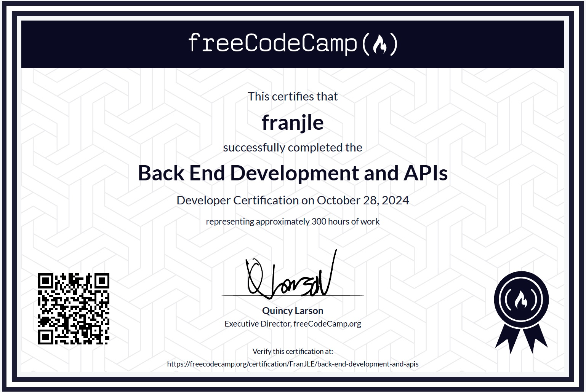

Proyectos para superar el curso del mismo nombre de freeCodeCamp.    

# Lenguaje, tecnologías    

- Lenguaje: Javascript    
- Uso de:   
    - Node   
    - Express   

## Certificado obtenido    

